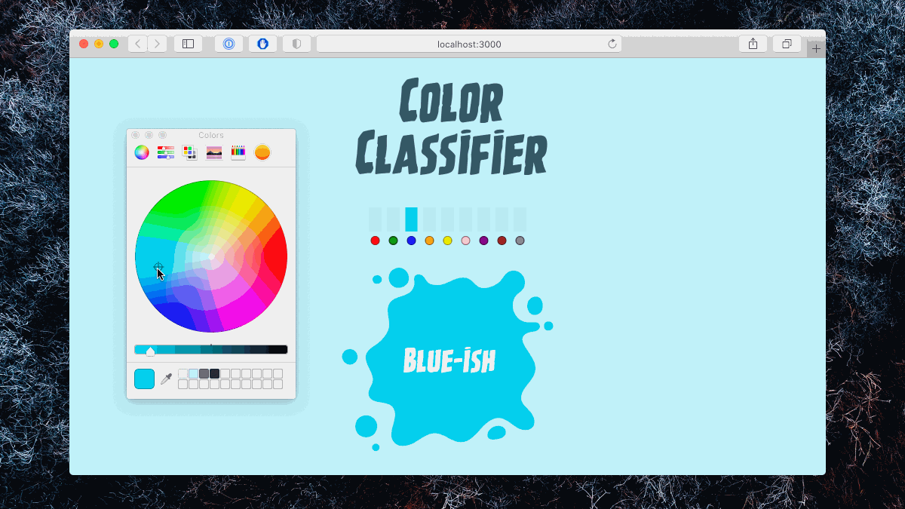

# Color Classifier

Train and deploy a model that classifies colors into discrete classes based on their RGB values.

## Try it out

[https://andyjakubowski.github.io/color-classifier/](https://andyjakubowski.github.io/color-classifier/)

## Folder structure

[`dist`](dist) contains the demo website that runs the model, and the page used to label colors.

[`python`](python) holds exported JSON data and the notebooks in which I trained and saved the Keras model.

## Twitter thread

The goal of this project was to learn how to build my own dataset and use it to train a model, all in five days. I described the details, and my learnings, in this [Twitter thread](https://twitter.com/jakubowskiandy/status/1329100296312807425).

## License

Licensed under the [MIT License](LICENSE).
